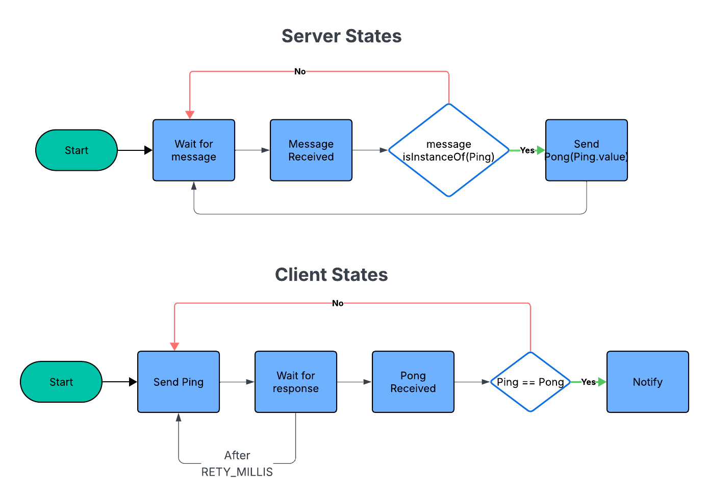

# Project 0: Report

### Intro (Your understanding)

The code implements a client-server for a simple ping-pong application. The roles of the client and server are as follows:
1. Client: sends a ping message and keeps resending until it receives a pong reply with the same value from the server
2. Server: receives message, and replies the sender with a Programming

### Flow of Control & Code Design

- Server
    - listens to the messages from client, and for any message which is an instance of `Ping`, it sends a reply `Pong` back to the client with the same value

- Client
    - sends a `Ping` request to the server
    - waits for the response from the server for `RETRY_MILLIS`
    - sends another request to the server if the response is not received in `RETRY_MILLIS`
    - once the response is recieved, it checks that the `Pong` value is same as `Ping` value that it sent
        - if same, client notifies the calling application about successful communication
        - else, wait for the correct message to be received

### Design Decisions

The code was provided for this lab.

### Missing Components

The code was provided for this lab.

### References

1. [Project 0 README](https://github.gatech.edu/cs7210-spr26/project0-intro/blob/main/lab/README.md)

### Extra (Optional)
