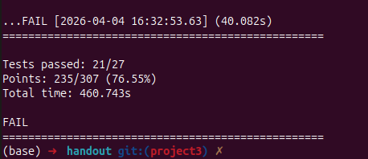

## Project 3: Report

### Intro (Your understanding)

This lab implements a fault-tolerant, distributed consensus system to build a replicated state machine. While the lab writeup and provided framework interfaces are tailored for Multi-Instance Paxos (specifically Paxos Made Moderately Complex), I chose to implement the Raft consensus algorithm.

To ensure strong consistency, Raft relies on a strong leader model. A single Leader node receives client requests, appends them to a sequential log, and forces all Follower nodes to replicate this log exactly. If the Leader crashes or a network partition occurs, the remaining nodes hold an election to choose a new Leader with the most up-to-date log. The system guarantees linearizability and exactly-once execution (using an `AMOApplication` wrapper) even when faced with dropped packets, message reordering, and node crashes.

### Flow of Control & Code Design

**1. Leader Election Flow**

* **Timeouts:** Every node runs a single, continuous `ElectionTimer` with a randomized timeout (e.g., 250ms - 450ms).
* **Trigger:** If a Follower's timer expires and its `heardFromLeader` flag is false, it transitions to a Candidate, increments its `currentTerm`, votes for itself, and broadcasts a `RequestVote` message.
* **Voting:** Nodes grant a vote if the incoming term is greater than or equal to their own, and the Candidate's log is "at least as up-to-date" (checked via `lastLogTerm` and `lastLogIndex`).
* **Promotion:** If a Candidate receives a majority of votes, it becomes the Leader and immediately broadcasts `AppendEntries` (heartbeats) to establish authority and prevent other nodes from starting elections.

**2. Log Replication Flow (Normal Operation)**

* The Leader receives a `PaxosRequest` from a client.
* It wraps the command in a `RaftLogEntry` (stamped with the `currentTerm`), appends it to its local `raftLog`, and updates its own `matchIndex`.
* The Leader sends `AppendEntries` messages to all Followers. This message includes the `prevLogIndex` and `prevLogTerm` for the new entry.
* **Consistency Check:** A Follower checks if its log matches the `prevLogTerm` at `prevLogIndex`. If it matches, it appends the new entries and replies with `success = true`. If it doesn't match, it replies `false` and sends back its current `matchIndex` to help the leader backtrack.
* **Commit:** Once the Leader receives successful replies from a majority of nodes for a specific index, it updates its `commitIndex`. It then applies the command to the `AMOApplication` state machine and sends a `PaxosReply` to the client.

**3. Garbage Collection Flow**

* Followers piggyback their `lastApplied` index onto their `AppendEntriesReply`.
* The Leader tracks these indices and calculates the global minimum execution point across all servers.
* The Leader sends this global minimum (`globalFirstNonCleared`) to Followers in subsequent `AppendEntries` messages.
* All servers then run a garbage collection routine to free memory for slots up to that index.

**4. The Client Flow**

* Clients always broadcast a `PaxosRequest` to all servers in the cluster and set a `ClientTimer`.
* If a Follower receives the request, it silently drops it.
* If the Leader receives the request, it processes it by appending it to the log and initiating replication.
* If a request times out (due to dropped packets, network partitions, or a crashed leader), the client simply broadcasts the request again.

### Design Decisions

* **Implementing Raft over PMMC:** I designed the system around Raft instead of Paxos. Raft's sequential log and strictly defined leader role made reasoning about edge cases and garbage collection much simpler compared to managing out-of-order consensus holes in Paxos slots. I bridged Raft's `commitIndex` logic to the framework's expected `PaxosLogSlotStatus` interfaces to satisfy the autograder.
* **The "Null-Out" Garbage Collection Strategy:** Raft relies heavily on absolute array indices for `prevLogIndex` checks. Removing executed items from the front of the `ArrayList` would shift all indices and break the protocol. **Decision:** Instead of deleting entries, the `garbageCollect()` method replaces executed `RaftLogEntry` objects with new ones where the `Command` is `null` but the `term` is preserved. This successfully freed enough memory to pass the limits of Test 11 while keeping all index math perfectly intact.
* **Silent Request Drops on Followers:** Initially, I considered having Followers reply to client broadcasts with a redirect to the known Leader. Because the client uses a brute-force broadcast model to survive the 20% packet drop rates in later tests, having Followers explicitly send redirect replies wastes significant network bandwidth. Instead, Followers silently drop client requests. Only the Leader processes the request, which drastically cuts down unnecessary network traffic during full throughput tests.
* **Aggressive Pipelining and Deduplication:** The strict 20% packet drop tests (Test 18 and 19) caused massive latencies. I implemented two optimizations. First, aggressive pipelining: if a follower rejected a log, the leader immediately sent the backtracked `AppendEntries` rather than lazily waiting for the next 50ms heartbeat. Second, log deduplication: if the leader received a client retry, it checked its uncommitted log tail. If the command was already pending, it just aggressively pushed `AppendEntries` again instead of adding duplicate entries to the log. This prevented network bloat and solved the maximum wait time timeouts.
* **Strict Monotonicity for Commit Index:** Search tests revealed a bug where a delayed, out-of-order heartbeat could temporarily drag a follower's `commitIndex` backward, violating invariants. **Decision:** I added strict monotonicity checks (`Math.max()`) to ensure `commitIndex` and `nextIndex` only ever move forward, or safely backward during a deliberate backtrack, ignoring delayed network ghosts.

### Missing Components

There is a discrepancy on the test cases that pass on my local v/s on gradescope. I could only pass 21/27 test cases on my local.

This includes Test Cases: 1-10, 12-16, 18-21, 24-25. However, on gradescope testcase 11 passes. I mostly face timeout errors in these cases and if the timelimit of the testcases were to increase, these tests might pass in some cases.

### References

* [&#34;In Search of an Understandable Consensus Algorithm (Extended Version)&#34;](https://raft.github.io/raft.pdf) by Diego Ongaro and John Ousterhout (The original Raft paper)
* DSLabs Framework documentation.
* DSLabs Visual Debugger (Crucial for visualizing message flows and diagnosing the timer explosion and backtracking deadlocks during Search Test timeouts).

### Extra (Optional)
