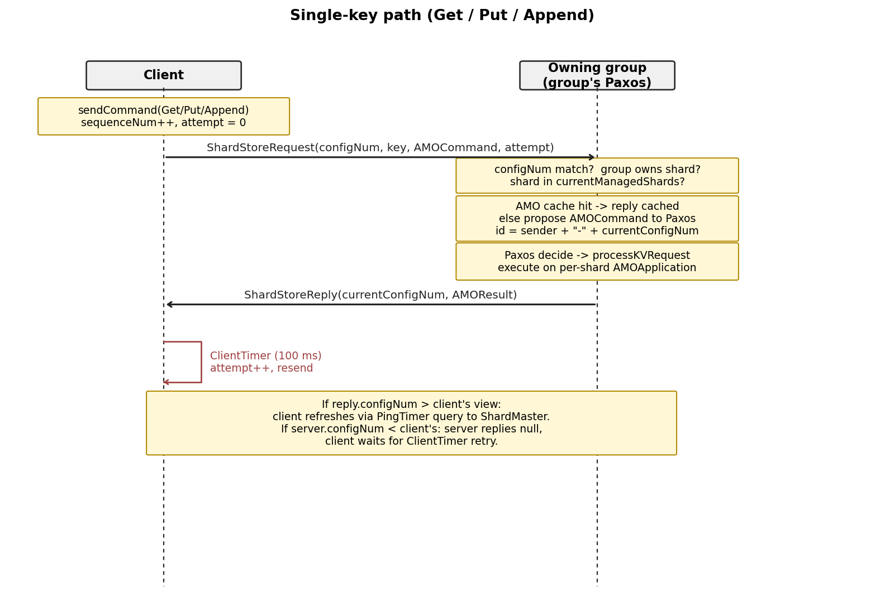
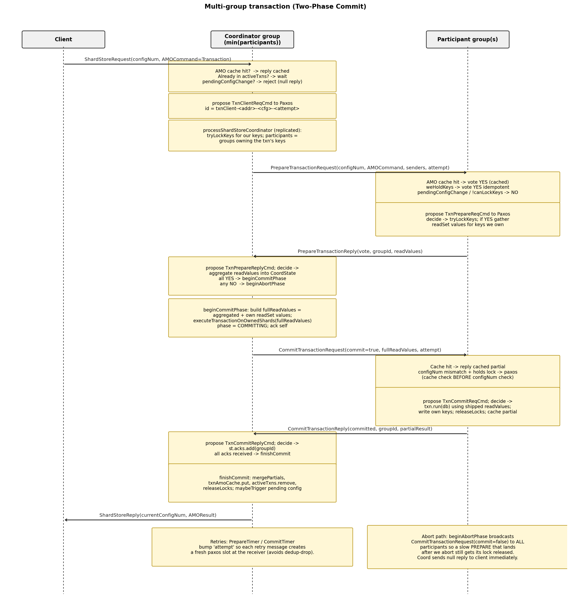

# Project 4: Report

## Intro (Your understanding)

This lab implements a sharded, transactional key-value store on top of the
DSLabs framework, reusing the Paxos engine from Project 3 for replication
inside each replica group. The system has three kinds of nodes:

1. **`ShardMaster`:** A Paxos-replicated configuration service. It owns a
   numbered sequence of `ShardConfig`s, each mapping every shard (1..N) to
   exactly one replica group, and exposes `Join` / `Leave` / `Move` /
   `Query`.
2. **`ShardStoreServer`:** One process per replica per group. Each group
   runs its own Paxos sub-node and serves the keys for the shards it
   currently owns under the latest `ShardConfig` it has applied.
3. **`ShardStoreClient`:** Issues `Get` / `Put` / `Append` (single-key) and
   `Transaction` (`MultiGet`, `MultiPut`, `Swap`; possibly multi-shard,
   multi-group) commands.

The work of the lab is to: (a) implement the `ShardMaster` and its
rebalancing algebra, (b) coordinate shard handoffs between groups when the
config advances, (c) replicate every state-mutating event in a group
through that group's Paxos so all replicas converge, and (d) run cross-
shard transactions with two-phase commit while staying atomic, isolated,
and idempotent under message loss and reordering.

## Flow of Control & Code Design

### 1. ShardMaster (`ShardMaster.java`)

* Maintains `currentConfigNum` and `configs: Map<Integer, ShardConfig>`.
* `Join(g, servers)`: deep-copies the current config, adds the new group
  with empty shards, calls `balanceConfig()` which moves shards one at a
  time from the largest group to the smallest until `max - min ≤ 1`.
* `Leave(g)`: deep-copies, removes group `g`, redistributes its shards to
  the remaining groups via a min-heap (smallest group first) so the result
  stays balanced.
* `Move(g, shardNum)`: deep-copies, transfers `shardNum` to group `g`.
* `Query(n)`: read-only. Returns config `n` (or the latest if `n == -1`).

### 2. Single-key path



Each shard has its own `AMOApplication<TransactionalKVStore>` so retries
are deduped per-shard.

### 3. Multi-group transaction path (2PC)



Single-group transactions skip 2PC: the coord runs `txn.run` over its own
shards directly, caches the result, and replies. `beginAbortPhase` mirrors
the commit path with `commit=false` and broadcasts to *every* participant
(not only the YES voters) so a slow PREPARE that lands at a participant
after the abort decision still gets its lock released; the null reply to
the client is sent immediately at the start of abort so the client can
retry without waiting for acks.

### 4. Replicated wrapper commands

Every event that mutates server state goes through the group's Paxos via a
wrapper `Command`: `ShardStoreCommand`, `NewConfigCmd`, `ShardMoveCmd`,
`ShardMoveAckCmd`, `TxnClientReqCmd`, `TxnPrepareReqCmd`,
`TxnPrepareReplyCmd`, `TxnCommitReqCmd`, `TxnCommitReplyCmd`. The
convention throughout is:

* `handle*(...)` runs on receipt and does pre-paxos checks, AMO/cache
  fast paths, then proposes the wrapper to Paxos.
* `process*(...)` runs from `handlePaxosDecision` and is the replicated
  body: every replica sees the same command in the same order.

### 5. Reconfiguration & shard handoff

* `PingTimer` (every 100 ms) calls `sendConfigRequest(currentConfigNum + 1)`
  to the ShardMaster (only when `isStable()` to avoid query storms during
  transfers).
* On `handlePaxosReply` carrying `ShardConfig N+1`:
    * if `isStable() && canApplyConfigChange()` propose `NewConfigCmd(N+1)`
      with a fresh `paxosProposalAttempt` suffix.
    * else stash as `pendingConfig` (and set `pendingConfigChange` so we
      reject new client work until it drains).
* `processNewConfig(N+1)` updates `currentConfigNum` / `currentConfig`,
  clears the pending flag, and calls `handleMove()` which sends a
  `MoveRequest` for every shard the group used to own but no longer does.
* The receiver's `processMoveRequest` admits the shard into
  `app[shardId]` and acks via `MoveReply`. The sender's `processMoveReply`
  removes the shard. `currentManagedShards == currentConfig[groupId].shards`
  is the `isStable()` predicate.
* `maybeTriggerPendingConfigChange()` is called whenever a lock is
  released or an active txn finishes; it arms a 1 ms `ConfigProposeTimer`
  that, when it fires, proposes the stashed `NewConfigCmd`. We *cannot*
  propose synchronously from the lock-release paths because they run inside
  a Paxos decide handler (see Design Decisions).

### 6. Cross-shard transaction execution

Each participant evaluates the txn in `executeTransactionOnOwnedShards`,
which builds a `db: Map<String, String>` and calls `txn.run(db)`. The
catch is that `Swap.run(db)` reads both keys and writes both keys. If a
participant only has its own keys in `db`, it sees the *other* key as
missing and falls into `Swap`'s "key not present, delete" branch, so
each side independently deletes the very key it was supposed to
overwrite, and after the commit both keys are gone. We solve this by
**shipping read values across the 2PC**:

* On a YES vote, each participant returns the values of its readSet keys
  in `PrepareTransactionReply.readValues`.
* The coord aggregates them in `CoordState.readValues`, adds its own local
  values (it never sent itself a PREPARE), and ships the combined
  `fullReadValues` map in `CommitTransactionRequest`.
* Every participant feeds that map into `executeTransactionOnOwnedShards`
  so `txn.run` sees a *full* pre-image db. Each side still writes back
  only the keys it owns; coord merges partials in `mergePartials`.

## Design Decisions

* **Per-key locks over a server-wide lock.** An earlier implementation
  serialized all transactions in a group on one lock, collapsing throughput
  in multi-client stress tests. `Map<String, AMOCommand> keyLocks` lets
  disjoint transactions run concurrently and is re-entrant: a re-prepare
  for the same `AMOCommand` is treated as already-held.
* **Per-transaction `CoordState` map.**
  `Map<AMOCommand, CoordState> activeTxns` lets a coord drive multiple
  transactions concurrently. Phase, prepareYes set, acks set, partials,
  and aggregated readValues all live in `CoordState`.
* **`attempt` counter on retried client / PREPARE / COMMIT messages.** The
  Project 3 `PaxosServer` keys its executed-record by `(id, seqNum)`.
  Without a per-retry suffix in the id, a request that was rejected
  post-paxos (transient lock conflict, configNum mismatch, etc.) has its
  retry silently dedup-dropped: paxos sees it as already-completed and
  never delivers another `PaxosDecision`, so the request stalls forever.
  The client bumps `attempt` in `onClientTimer`; the coordinator bumps it
  in `PrepareTimer` / `CommitTimer`. Each retry therefore carries a
  unique id and gets a fresh paxos slot.
* **`paxosProposalAttempt` on internal proposals.** `newConfig-N`,
  `shardMove-S-N`, and `shardMoveAck-S-N` were originally keyed only on
  configNum/shardId. When a `process*` handler early-returns post-paxos
  (e.g., `processNewConfig` finds that `newConfig.configNum()` no longer
  equals `currentConfigNum + 1` after an intervening apply), the next
  `PingTimer` re-proposes with the same id and Paxos's dedup swallows it
  forever. Bumping a per-propose counter on the id guarantees every retry
  gets a fresh slot.
* **Cache-before-configNum on retried COMMITs.** A retry of an already-
  committed COMMIT must return the cached partial regardless of any
  subsequent config drift, since replying `partial=null` after we've
  cached the real partial would let the coord's `mergePartials` produce
  phantom `KEY_NOT_FOUND`s for keys we actually wrote. The cache check
  therefore precedes the configNum check in both `handle` and `process`
  versions of `CommitTransactionRequest`.
* **Deferred reconfiguration.** We never apply `ShardConfig N+1` while any
  lock is held (`canApplyConfigChange()` checks both `keyLocks.isEmpty()`
  and `activeTxns.isEmpty()`). This preserves the invariant that a server
  processing a transaction at config N stays at config N for the entire
  2PC, so coord and participants always agree on shard ownership.
* **`min(participants)` coordinator selection.** Both client and server
  compute the coordinator deterministically as the smallest groupId among
  the groups owning at least one of the txn's keys at the current config.
  Servers that aren't the coord under their own view drop the request and
  the client retries.
* **Shipping readValues across 2PC.** Keeps `txn.run(db)` untouched while
  letting cross-shard writes (Swap) compute correctly. Each side still
  writes only the keys it owns; the rest of the new db state is
  discarded.
* **`ConfigProposeTimer` (1 ms) breaks paxos drain re-entry.**
  `maybeTriggerPendingConfigChange` is called from inside Paxos decide
  handlers (e.g., `processCommitTransactionRequest`). Project 3's
  `PaxosServer.updatePaxosLog` calls `sendRequestReply` *before*
  incrementing `slotOut`, so a synchronous re-entrant
  `handleMessage(PaxosRequest, paxosAddress)` re-enters the same drain at
  the same `slotOut` and recurses without bound (`StackOverflowError`
  reproduced in test 4.7). Arming a 1 ms timer pushes the propose to the
  next event-loop iteration. A `configProposeTimerArmed` flag prevents
  queueing duplicate timers when several lock-release paths fire in quick
  succession.
* **Defensive `releaseLocks` on configNum-mismatched COMMIT/ABORT.** By
  invariant a participant holding a lock for txn X cannot have advanced
  past X's config, but if that invariant is ever violated the original
  configNum-mismatch path acked without releasing the lock, producing
  a permanent wedge that pinned `canApplyConfigChange()` at false. The
  fixed path is: at the pre-paxos `handle*` site, if no lock is held for
  this command we ack directly (nothing to release); if a lock IS held
  we fall through to paxos so the matching `process*` site can call
  `releaseLocks(command)`, keeping the release replicated across all
  group replicas.

## Missing Components

**Active Gradescope submission.** The code on this branch corresponds to
**submission 13**, which is the one I have activated for grading. I
later pushed a **submission 15** that managed to pass test 4.10 (the
single-server random-search test), but in fixing the search path it
regressed tests 4.5 and 4.6, losing more total points than it
gained. Submission 13 is therefore the higher-scoring snapshot and is
the one being graded; the failure list below reflects submission 13.

The submitted code passes the rest of the suite but six tests fail:

* **4.7 (`test07ConstantMovementSingleServer`):** single-server-per-group
  with constant shard movement (every 4 s) plus `networkDeliverRate(0.8)`.
  Catch-up to new configs is bottlenecked on `onPingTimer` only querying
  the ShardMaster while `isStable()` and `handlePaxosReply` only acting
  on a config when `isStable() && canApplyConfigChange()`. Under sustained
  drops the group can fall multiple configs behind and the per-client
  `MaxWaitTime` exceeds the 4000 ms allowance. We tried always-querying
  the ShardMaster, stashing configs mid-move, and an `isReconfiguring()`
  rejection driven by a `maxConfigNum` watermark; each fixed 4.7
  partially but regressed the reliable / non-movement tests, so we
  reverted to a conservative version.
* **4.10 (`test10SingleServerRandomSearch`):** DFS search test. The
  per-retry `attempt+1` suffix on internal Paxos proposal ids makes
  every retransmission a distinct state, so the reachable-state graph
  explodes and the search at `maxDepth(1000)` exhausts its time budget
  before reaching the goal predicate. A future fix would equate states
  that differ only in the retry counter.
* **4.15 (`test15RepeatedPutsGets`):** multi-server-per-group, reliable
  network, no shard movement, 5 clients × 50 s. Most of the time the
  workload runs cleanly, but coordinated 2PC across three groups (each
  doing its own Paxos round-trip per PREPARE/COMMIT) occasionally
  breaches the 4000 ms `MaxWaitTime` bound. Likely root cause: paxos
  slot growth from per-attempt unique ids inflates GC overhead on the
  per-group `PaxosServer`.
* **4.16 (`test16RepeatedPutsGetsUnreliableMultiServer`):** same as
  4.15 plus `networkDeliverRate(0.8)`. Same latency profile, just with
  more retries; long-tail max-wait blows the 4000 ms threshold.
* **4.17 (`test17ConstantMovement`):** multi-server analogue of 4.7
  (movement + 0.8 delivery + 3-replica groups). Inherits both 4.7's
  catch-up bottleneck and 4.16's tail-latency issue.
* **5.3 (`test03MultiClientMultiGroupSearch`):** multi-client,
  multi-group search test for the transactional path. Same state-space
  explosion mechanism as 4.10, made worse by the 2PC paths adding
  multiple per-message paxos slots per client request.

## References

* **[Lab 4 Handout](https://github.gatech.edu/cs7210-spr26/project4-shardkvstore):** Spec for `ShardMaster`, `ShardStoreServer`, `ShardStoreClient`, the message contract, and the test invariants (RESULTS_OK, MULTI_GETS_MATCH, max-wait-time bound).
* **[Lab 3 Handout](https://github.gatech.edu/cs7210-spr26/project3-paxos):** Paxos engine reused unchanged here as the per-group replication backbone; reviewed its `whetherRequestComplete` / `whetherRequestInProposal` dedup contract while debugging the `(id, seqNum)` issues that led to the `attempt` counters.
* **DSLabs framework source (`framework/`):** `Node.handleMessage`, sub-node addressing via `Address.subAddress`, and `set(Timer, delay)` semantics, needed to choose between synchronous reentry and timer-deferred propose for `maybeTriggerPendingConfigChange`.
* **Course lecture notes** on Multi-Paxos (log-structured replication) and Two-Phase Commit (PREPARE/COMMIT message exchange).
* **Tanenbaum, *Distributed Systems*:** 2PC protocol overview used for the abort/commit phase design.
* **Anthropic Claude:** used moderately, mostly to think out loud while reading failing test logs and to sketch a couple of small code patches. Specific things it helped surface (and which I then verified and implemented myself): (1) the cross-shard `Swap` correctness bug, where each participant's local `db` was missing the other shard's value, leading to the `KEY_NOT_FOUND` delete branch; (2) the suggestion to ship `readValues` across the 2PC as the cleanest way to fix it; (3) noticing that the per-retry `attempt` suffix idea also needed to be applied to internal `newConfig-N` / `shardMove-S-N` proposals to avoid post-paxos dedup. Final designs, invariants, and the code are mine.
* **[Java `HashMap` / `Map` interface](https://docs.oracle.com/javase/8/docs/api/java/util/Map.html):** for `entrySet().removeIf(...)` (used in `releaseLocks`) and re-entrant `put` semantics on the `keyLocks` map.
* **[Apache Commons Lang `Pair`](https://commons.apache.org/proper/commons-lang/apidocs/org/apache/commons/lang3/tuple/Pair.html):** used in `ShardConfig.groupInfo()` to bundle each group's servers and shards.

## Extra (Optional)

**Problem.** `dslabs.paxos.PaxosServer.updatePaxosLog` calls
`sendRequestReply(...)` *before* incrementing `slotOut`:

```java
while (slotOut < slotIn) {
    if (PaxosLog.get(slotOut).status != CHOSEN) break;
    PaxosRequest request = PaxosLog.get(slotOut).paxosRequest();
    sendRequestReply(request);          // <-- side effect; can re-enter
    updateExcutedRecord(slotOut, request);
    slotOut += 1;
}
```

If `sendRequestReply` triggers any code path that ends up calling
`handleMessage(new PaxosRequest(...), paxosAddress)` synchronously (for
example, the application's commit handler doing a follow-up Paxos
propose), the inner drain re-reads the same `slotOut`, finds it still
`CHOSEN`, and recursively drains the same slot, hitting `StackOverflowError`.
We hit this in test 4.7 along the chain
`processCommitTransactionRequest` then `maybeTriggerPendingConfigChange`
then `handleMessage(new PaxosRequest("newConfig-N-X", ...), paxosAddress)`.

**Proposed fix.** Increment `slotOut` *before* calling `sendRequestReply`,
so a re-entrant drain finds the now-incremented `slotOut` and either
breaks (next slot not CHOSEN) or processes the *next* slot once:

```java
while (slotOut < slotIn) {
    PaxosLogSlot slot = PaxosLog.get(slotOut);
    if (slot.status != CHOSEN) break;
    PaxosRequest request = slot.paxosRequest();
    int processed = slotOut;
    slotOut += 1;                       // advance first
    updateExcutedRecord(processed, request);
    sendRequestReply(request);          // safe to re-enter
}
```

This makes the drain re-entrant-safe and removes the need for application
code to defer follow-up Paxos proposals via timers (our current
`ConfigProposeTimer` workaround).
